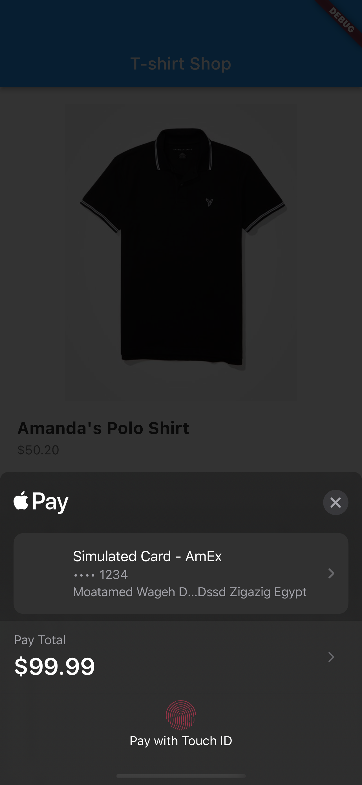
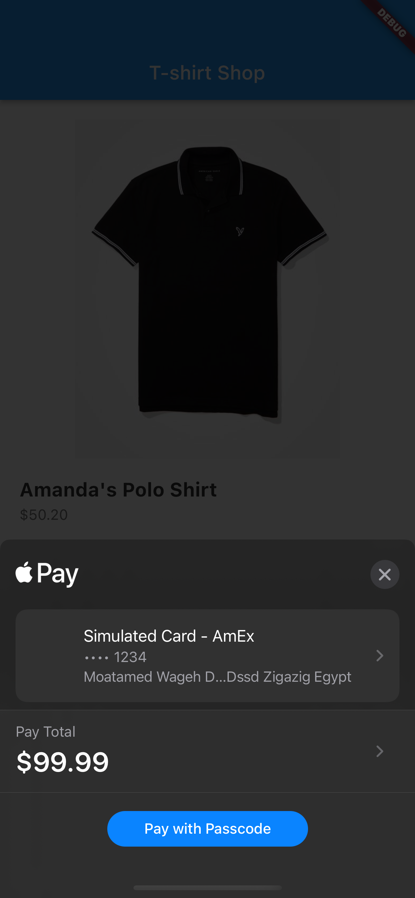
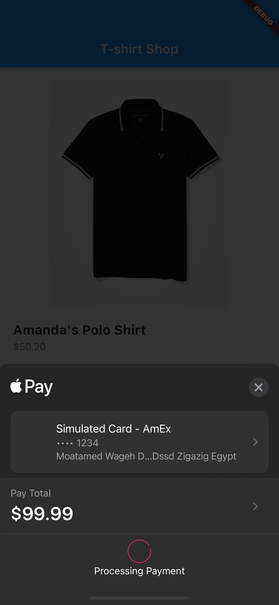

# Apple Pay Example

To use this project :
    1 - go to app store connect and create merchantId
    2 - add apple pay in xcode
    

    3- open assets/files/apple_pay.json and add merchant Id in merchantIdentifier

Run and Enjoy  😘  😘  😘

